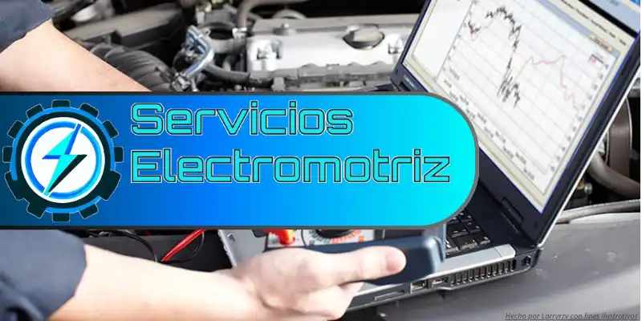

    
  <h2>
    Pagina de ejemplo de Tecnico Electromotriz
  </h2>

<h3>Resumen</h3>

Este repositorio contiene un pequeño proyecto mío con la única intención de demostrar y proporcionar un ejemplo físico de mis habilidades como programador Frontend.

Se trata de una sencilla página estática que simula ser la página publicitaria de un técnico electromotriz. Todo el código ha sido creado exclusivamente por mí. Sin embargo, es importante destacar que los elementos artísticos, como el logo, la imagen de fondo, los iconos y otras imágenes, <strong>no me pertenecen</strong> El logo fue generado mediante una IA y luego modificado por mí, mientras que las imágenes que no provienen de la IA fueron seleccionadas a través de un motor de búsqueda. No tengo ningún tipo de autoría sobre ellas, y mi única intención al crear esta página es realizar un ejercicio creativo.

Agradezco a los artistas originales por su trabajo y espero que disfruten explorando este proyectos y los demas.

**Toda esta pagina fue hecha a partir de**:

- HTML, CSS & Javascript.

<h3>Si quieres ver la pagina aqui esta el link de mi <a href="">Portfolio</a> el cual contiene mi pagina</h3>

<!-- Hola, aqui Larryrzv y este codigo fue editado por ultima vez el: 26/04/2024, por: "Larryrzv" -->
